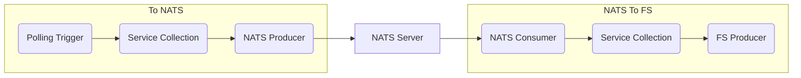

# NATS Testing

[](https://github.com/interlok-testing/testing_nats/blob/develop/LICENSE)
[](https://github.com/interlok-testing/testing_nats/actions/workflows/gradle-build.yml)

Project tests interlok-nats features

## What it does

This project is very simple and contains two channels with one workflow each.

The first workflow has a polling trigger that produces a message every 10 seconds and publish it to a NATS subject.

The second workflow is listening on the subject and copy the message on the file system.



## Getting started

Before starting Interlok you need to create a NATS docker container with

* `docker-compose up`

Then start Interlok

* `./gradlew clean build`
* `(cd ./build/distribution && java -jar lib/interlok-boot.jar)`

The config is using a variables.properties to configure the NATS url, subject and the file system directory.

```
natsHost=localhost
natsPort=4222
natsUrl=nats://${natsHost}:${natsPort}
natsSubject=natsSubject
fsDir=file://localhost/./messages/in
```
